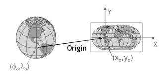
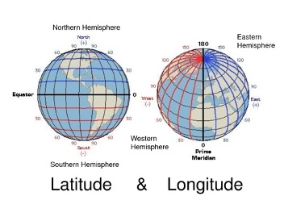

```{css, echo=FALSE} 
@media print { # print out incremental slides; see https://stackoverflow.com/questions/56373198/get-xaringan-incremental-animations-to-print-to-pdf/56374619#56374619
  .has-continuation {
    display: block !important;
  }
}
```

```{r setup, include=FALSE}
# figures formatting setup
options(htmltools.dir.version = FALSE)
library(knitr)
opts_chunk$set(
  prompt = T,
  fig.align="center", #fig.width=6, fig.height=4.5, 
  # out.width="748px", #out.length="520.75px",
  dpi=300, #fig.path='Figs/',
  cache=T, #echo=F, warning=F, message=F
  engine.opts = list(bash = "-l")
  )
## Next hook based on this SO answer: https://stackoverflow.com/a/39025054
knit_hooks$set(
  prompt = function(before, options, envir) {
    options(
      prompt = if (options$engine %in% c('sh','bash')) '$ ' else 'R> ',
      continue = if (options$engine %in% c('sh','bash')) '$ ' else '+ '
      )
})
```

 
```{r, include=FALSE}

# Importing the relevant libraries
#install.packages("hrbrthemes")
#install.packages("fontawesome")
library(hrbrthemes)
library(fontawesome)

# install.packages("pagedown")
# install.packages("xaringan")
library(pagedown)
library(xaringan)

library(sf)          # classes and functions for vector data
library(terra)      # classes and functions for raster data
library(spData)        # load geographic data
library(spDataLarge)   # load larger geographic data
library(tidyverse)
```

#Agenda 

1. [Modeling the world ](#Modelling the World)
2. [What are CRS? ](#)
3. [CRS and Datums ](#)
4. [CRS in R](#)
5. [XXX](#)
6. [Spatial Data Operations](#)


---
#Modelling the World
##How does the Earth really look like? 
Refreshing you knowledge from your Geo-course during high school/undergrad-studies...

.pull-left-small2[
<div align="center">
<br>

</div>
]

---
#What is a “Coordinate Reference System” (CRS) ?
##(= Geographic Coordination System or Spatial Reference System) 

.pull-left[
- Used to model the World 
- Set locations 
- Utilize 
  - latitude (horizontal) 
  - longitude (vertical)
- basis for planar coordinates and GIS (Geoinformation Systems)

<div align="center">

</div>
[Sreedevi, 2021 ](https://www.analyticsvidhya.com/blog/2021/09/how-to-visualise-data-in-maps-using-geopandas/)
]

.pull-right[
<div align="center">
<br><br>

</div>
[Mike Mitter, 2019](https://www.mikemitterer.at/2019/07/11/latitude-longitude-module-ist-auf-npmjs/
)
]

---
#CRS and Datums

###As you have seen the Ellipsoid cannot model the earth (not even the Geoid) completely 


.pull-left[
Therefore, different Coordinate Reference Systems exist:

- **World Geodetic System** 
  - (WGS84, EPSG:4326)
  - approximates the whole earth
  - standard model
- **North American Datum** 
  - (NAD83, EPSG:6269)
- **Australian Geodetic Datum** 
  - (AGD84, EPSG:420)

]

.pull-right[
<div align="center">
<br>

</div>
[IOSM Austrailia, 2021 ](https://www.icsm.gov.au/sites/default/files/inline-images/regional_0.jpg)
]


Datums can usually be converted to one another.

---

# Introduction to sf package
.pull-right[
<div align="center">
<br>

</div>
[Geocomputation with R, 2021 ](https://edzer.github.io/rstudio_conf/#13)]
<b> Simple Features (sf) </b> describe how objects in the real world (such as a building or a tree) can be represented in computers.

Features have a <i>geometry </i> describing <i>where </i> on Earth the feature is located, and they have attributes, which describe other properties. 

These geometries are represented by points, lines or polygons, or collections thereof (no curves).

## Example
Let’s look at how data is stored in a simple feature:
```{r, include=FALSE}
nc <- st_read(system.file("shape/nc.shp", package="sf"))
```

```{r, eval = TRUE}
class(nc) #nc is a shapefile within the package sf

attr(nc, "sf_column")

```
---

# CRS in sf

## Example
Let’s look at how CRSs are stored in R spatial objects and how they can be set. For this, we need to read-in a vector dataset:

```{r}
vector_filepath <- system.file("shapes/world.gpkg", package = "spData")
new_vector <- read_sf(vector_filepath)
```

Our new object, new_vector, is a polygon representing a world map data from Natural Earth with a few variables from World Bank (?spData::world).

```{r, eval = TRUE}
head(new_vector)

```


---

# EXAMPLE Three Key Features
## 1 | Retrieve coordinate reference system from object
In sf the CRS of an object can be retrieved using st_crs().
```{r}
st_crs(new_vector) # get CRS
```

---

# EXAMPLE Three Key Features
## 2 | Add CRS to a Shapefile
- so you can layer point data onto geometry and create complex maps

---

# EXAMPLE Three Key Features
## 3 | Transform or convert coordinates of simple feature

```{r}
p1 = st_point(c(7,52))
p2 = st_point(c(-30,20))
sfc = st_sfc(p1, p2, crs = 4326)
sfc
#> Geometry set for 2 features 
#> Geometry type: POINT
#> Dimension:     XY
#> Bounding box:  xmin: -30 ymin: 20 xmax: 7 ymax: 52
#> Geodetic CRS:  WGS 84#> POINT (7 52)#> POINT (-30 20)st_transform(sfc, 3857)
#> Geometry set for 2 features 
#> Geometry type: POINT
#> Dimension:     XY
#> Bounding box:  xmin: -3339585 ymin: 2273031 xmax: 779236.4 ymax: 6800125
#> Projected CRS: WGS 84 / Pseudo-Mercator#> POINT (779236.4 6800125)#> POINT (-3339585 2273031)st_transform(st_sf(a=2:1, geom=sfc), "+init=epsg:3857")
#> Warning: GDAL Message 1: +init=epsg:XXXX syntax is deprecated. It might return a CRS with a non-EPSG compliant axis order.#> Simple feature collection with 2 features and 1 field
#> Geometry type: POINT
#> Dimension:     XY
#> Bounding box:  xmin: -3339585 ymin: 2273031 xmax: 779236.4 ymax: 6800125
#> Projected CRS: WGS 84 / Pseudo-Mercator
#>   a                     geom
#> 1 2 POINT (779236.4 6800125)
#> 2 1 POINT (-3339585 2273031)try(st_transform(sfc, 3857, aoi = c(-280,-90,180,90)))
#> Warning: GDAL Error 1: Invalid dfWestLongitudeDeg#> Error in CPL_transform(x, crs, aoi, pipeline, reverse, desired_accuracy,  : 
#>   values for area of interest not accepted

if (sf_extSoftVersion()["GDAL"] >= "3.0.0") 
  { st_transform(sfc, pipeline =
    "+proj=pipeline +step +proj=axisswap +order=2,1") # reverse axes
  st_transform(sfc, pipeline =
    "+proj=pipeline +step +proj=axisswap +order=2,1", reverse = TRUE) } # also reverse axes

#> Geometry set for 2 features 
#> Geometry type: POINT
#> Dimension:     XY
#> Bounding box:  xmin: -30 ymin: 20 xmax: 7 ymax: 52
#> CRS:           NA#> POINT (7 52)#> POINT (-30 20)nc = st_read(system.file("shape/nc.shp", package="sf"))
#> Reading layer `nc' from data source 
#>   `/private/var/folders/24/8k48jl6d249_n_qfxwsl6xvm0000gn/T/RtmpOavmau/temp_libpath94fd3649a05d/sf/shape/nc.shp' 
#>   using driver `ESRI Shapefile'
#> Simple feature collection with 100 features and 14 fields
#> Geometry type: MULTIPOLYGON
#> Dimension:     XY
#> Bounding box:  xmin: -84.32385 ymin: 33.88199 xmax: -75.45698 ymax: 36.58965
#> Geodetic CRS:  NAD27st_area(nc[1,]) # area from long/lat
#> 1137107793 [m^2]st_area(st_transform(nc[1,], 32119)) # NC state plane, m
#> 1137590142 [m^2]st_area(st_transform(nc[1,], 2264)) # NC state plane, US foot
#> 12244869403 [US_survey_foot^2]library(units)
#> udunits database from /Users/runner/work/_temp/Library/units/share/udunits/udunits2.xmlset_units(st_area(st_transform(nc[1,], 2264)), m^2)
#> 1137590142 [m^2]st_transform(structure(p1, proj4string = "+init=epsg:4326"), "+init=epsg:3857")
#> POINT (779236.4 6800125)st_wrap_dateline(st_sfc(st_linestring(rbind(c(-179,0),c(179,0))), crs = 4326))
#> Geometry set for 1 feature 
#> Geometry type: MULTILINESTRING
#> Dimension:     XY
#> Bounding box:  xmin: -180 ymin: 0 xmax: 180 ymax: 0
#> Geodetic CRS:  WGS 84#> MULTILINESTRING ((-179 0, -180 0), (180 0, 179 0))library(maps)
wrld <- st_as_sf(maps::map("world", fill = TRUE, plot = FALSE))
wrld_wrap <- st_wrap_dateline(wrld, options = c("WRAPDATELINE=YES", "DATELINEOFFSET=180"),
   quiet = TRUE)
#> Warning: GDAL Error 1: IllegalArgumentException: Points of LinearRing do not form a closed linestring#> Warning: GDAL Error 1: IllegalArgumentException: Points of LinearRing do not form a closed linestring

wrld_moll <- st_transform(wrld_wrap, "+proj=moll")
plot(st_geometry(wrld_moll), col = "transparent")
sf_proj_info("datum")
#> data frame with 0 columns and 0 rows
```

---
# How to work with Spatial Data (1)
##Some simple spatial data operations

1) **Geometric measurements**
-CRSs include information about spatial units, however it is generally difficult to work with units to do geometric calculations (see difference of latitude and longitude data and planar coordinate systems) -> the recent version of sf utilizes the units package which output is by default provided in m^2 

Lets see how that looks like for Belgium. We use the world data from the spData package:

```{r}
Belgium = world[world$name_long == "Belgium", ]
st_area(Belgium) 
```

The number appears really big, better to set the units to km^2: 

```{r}
units::set_units(st_area(Belgium), km^2)
```

---
# How to work with Spatial Data (2)
##Some simple spatial data operations

2) **Geometric measurements**
-sf can also measure distances between two points based on geometric data.

The package `spData` contains geometric data on London's districts `lnd` and a dataset of cycle hire points in London `cycle_hire`. 

We want to measure the distance from the cycle hire point at the Palace Gate to the centre of Redbridge. 

```{r}
cycle_station_palace = cycle_hire %>% filter(name == "Palace Gate")
redbridge = lnd %>% filter(NAME == "Redbridge")
redbridge_centroid = st_centroid(redbridge) #gives central point in selected district
st_distance(cycle_station_palace, redbridge_centroid)
```
The default of `st_distance()` is in m. We could can /1000 to get km. 

---
# How to work with Spatial Data (3)
##Creating maps with geometric data and sf

There a different ways to create maps based on geometric data. 
1. One simple way is by using `ggplot()` in combination with `geom_sf()` from the sf package 


```{r}
ggplot() +
geom_sf(data = us_states) + #For simple plots, you will only need geom_sf() 
coord_sf(crs = st_crs(4326)) #ensures that all layers use a common CRS (would not be needed in this case)
```

---
# How to work with Spatial Data (4)
##Creating maps with geometric data and sf

There a different ways to create maps based on geometric data. 
1. One simple way is by using `ggplot()` in combination with `geom_sf()` from the sf package 
2. sf also comes with a `plot()` function which creates a map of a sf object with  one or more attributes.

```{r echo = TRUE}
us_income = left_join( 
  #joining two data frames from spData to attribute Median Income in 2015 to us_states
  us_states, us_states_df, 
  by = c("NAME" = "state"))
plot(us_income["median_income_15"], 
     main = "Median income per State in 2015") #using the plot function 

```

---
## Slide with R Output

```{r cars, echo = TRUE}
summary(cars)
```

## Print the Slides

```{r}
#text has to go back
```


