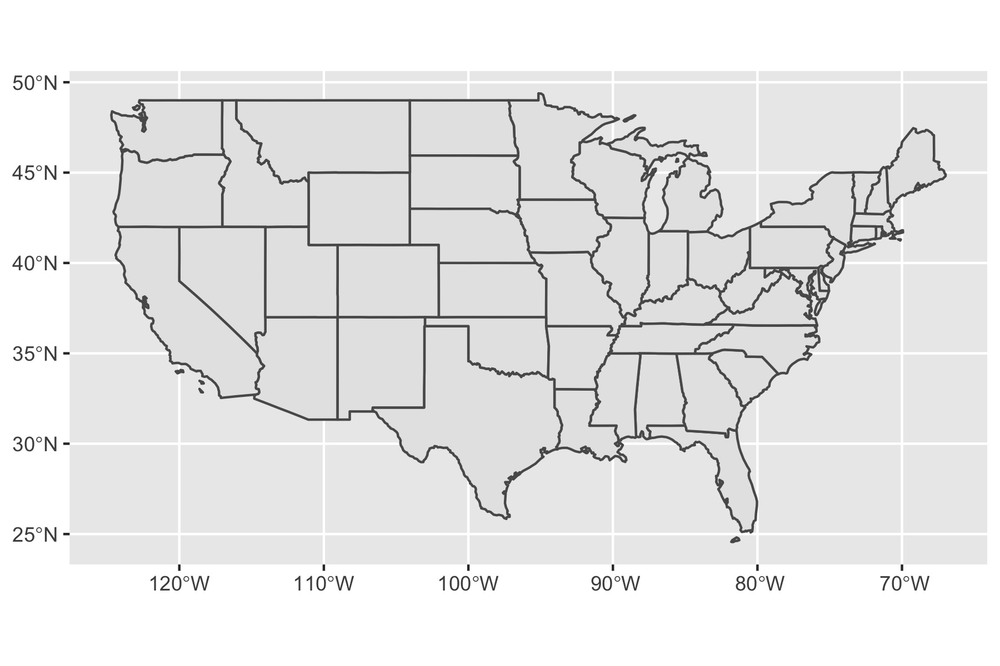
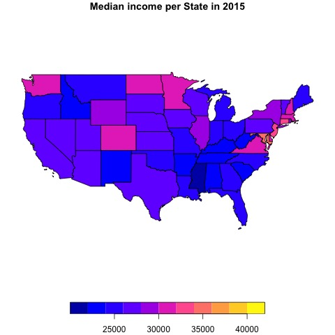

```{css, echo=FALSE} 
@media print { # print out incremental slides; see https://stackoverflow.com/questions/56373198/get-xaringan-incremental-animations-to-print-to-pdf/56374619#56374619
  .has-continuation {
    display: block !important;
  }
}
```

```{r setup, include=FALSE}
# figures formatting setup
options(htmltools.dir.version = FALSE)
library(knitr)
opts_chunk$set(
  prompt = T,
  fig.align="center", #fig.width=6, fig.height=4.5, 
  # out.width="748px", #out.length="520.75px",
  dpi=300, #fig.path='Figs/',
  cache=T, #echo=F, warning=F, message=F
  engine.opts = list(bash = "-l")
  )
## Next hook based on this SO answer: https://stackoverflow.com/a/39025054
knit_hooks$set(
  prompt = function(before, options, envir) {
    options(
      prompt = if (options$engine %in% c('sh','bash')) '$ ' else 'R> ',
      continue = if (options$engine %in% c('sh','bash')) '$ ' else '+ '
      )
})
```

 
```{r, include=FALSE}

# Importing the relevant libraries
#install.packages("hrbrthemes")
#install.packages("fontawesome")
library(hrbrthemes)
library(fontawesome)

# install.packages("pagedown")
# install.packages("xaringan")
library(pagedown)
library(xaringan)

library(sf)          # classes and functions for vector data
library(terra)      # classes and functions for raster data
library(spData)        # load geographic data
library(spDataLarge)   # load larger geographic data
library(tidyverse)
```

#Agenda 

##1. Modelling the world 
##2. What are CRS? 
##3. CRS and Datums
##4. CRS in R  
###4.1 Two Key Features
###4.2 Spatial Data Operations
##5. Further Resources


---
#Modelling the World
##How does the Earth really look like? 
Refreshing you knowledge from your Geo-course during high school/undergrad-studies...

.pull-left-small2[
<div align="center">
<br>

</div>
]

---
#What is a “Coordinate Reference System” (CRS) ?
##(= Geographic Coordination System or Spatial Reference System) 

.pull-left[
- Used to model the World 
- Set locations 
- Utilize 
  - latitude (horizontal) 
  - longitude (vertical)
- basis for planar coordinates and GIS (Geoinformation Systems)

<div align="center">

</div>
[Sreedevi, 2021 ](https://www.analyticsvidhya.com/blog/2021/09/how-to-visualise-data-in-maps-using-geopandas/)
]

.pull-right[
<div align="center">
<br><br>

</div>
[Mike Mitter, 2019](https://www.mikemitterer.at/2019/07/11/latitude-longitude-module-ist-auf-npmjs/
)
]

---
#CRS and Datums

**As you have seen the Ellipsoid cannot model the earth (not even the Geoid) completely**

Therefore, different Coordinate Reference Systems exist:

.pull-left[
- **World Geodetic System** 
  - (WGS84, EPSG:4326)
  - approximates the whole earth
  - standard model
  
- **North American Datum** 
  - (NAD83, EPSG:6269)
  
- **Australian Geodetic Datum** 
  - (AGD84, EPSG:420)


- Datums can usually be converted to one another.
]

.pull-right[
<div align="center">
<br>

</div>
[IOSM Austrailia, 2021 ](https://www.icsm.gov.au/sites/default/files/inline-images/regional_0.jpg)
]

---

# Introduction to sf package
.pull-right[
<div align="center">
<br>

</div>
[Geocomputation with R, 2021 ](https://edzer.github.io/rstudio_conf/#13)]
<b> Simple Features (sf) </b> describe how objects in the real world (such as a building or a tree) can be represented in computers.

Features have a <i>geometry </i> describing <i>where </i> on Earth the feature is located, and they have attributes, which describe other properties. 

These geometries are represented by points, lines or polygons, or collections thereof (no curves).

## Example
Let’s look at how data is stored in a simple feature:
```{r, include=FALSE}
nc <- st_read(system.file("shape/nc.shp", package="sf"))
```

```{r, eval = TRUE}
class(nc) #nc is a shapefile within the package sf

attr(nc, "sf_column")

```
---

# CRS in sf


Let’s look at how CRSs are stored in R spatial objects and how they can be set. For this, we need to read-in a vector dataset:

```{r}
vector_filepath <- system.file("shapes/world.gpkg", package = "spData")
new_vector <- read_sf(vector_filepath)
```

Our new object, new_vector, is a polygon representing a world map data from Natural Earth with a few variables from World Bank (?spData::world).

```{r, eval = TRUE}
head(new_vector)
```
---

#Key Features (1) 
## 1 | Retrieve coordinate reference system from object

.pull-left[
In sf the CRS of an object can be retrieved using st_crs().
```{r, eval = FALSE, prompt = FALSE}
R> st_crs(new_vector) # get CRS
```
]

.pull-right[
```{r, eval = FALSE, prompt = FALSE}
Coordinate Reference System:
  User input: WGS 84 
  wkt:
GEOGCRS["WGS 84",
    DATUM["World Geodetic System 1984",
        ELLIPSOID["WGS 84",6378137,298.257223563,
            LENGTHUNIT["metre",1]]],
    PRIMEM["Greenwich",0,
        ANGLEUNIT["degree",0.0174532925199433]],
    CS[ellipsoidal,2],
        AXIS["geodetic latitude (Lat)",north,
            ORDER[1],
            ANGLEUNIT["degree",0.0174532925199433]],
        AXIS["geodetic longitude (Lon)",east,
            ORDER[2],
            ANGLEUNIT["degree",0.0174532925199433]],
    USAGE[
        SCOPE["Horizontal component of 3D system."],
        AREA["World."],
        BBOX[-90,-180,90,180]],
    ID["EPSG",4326]]
```
]

---
#Key Features (2)
## 1 | Retrieve coordinate reference system from object
The st_crs function also has one helpful feature – we can retrieve some additional information about the used CRS. 

For example, try to run:
```{r, eval = TRUE}
st_crs(new_vector)$IsGeographic #to check if the CRS is geographic or not
st_crs(new_vector)$units_gdal #to find out the CRS units
st_crs(new_vector)$srid #extracts its SRID (when available)
st_crs(new_vector)$proj4string #extracts the proj4string representation
```
---
#Key Features (3)
## 2 | Add or Change CRS
When the CRS is missing or the wrong CRS is set, the st_set_crs() function can be used. An important note is that replacing CRS does not re-project data and maintains data integrity.

```{r, eval = TRUE, warning = FALSE}
new_vector <- st_set_crs(new_vector, "EPSG:4326") # set CRS
```
```{r, include=FALSE}
ggplot() +
geom_sf(data = new_vector) + #For simple plots, you will only need geom_sf() 
coord_sf(crs = st_crs(4326)) #ensures that all layers use a common CRS (would not be needed in this case)
ggsave(path = "sf_presentation_files/figure-html", filename = "plot.jpg", width = 6, height = 4)
```
```{r, eval = TRUE, warning = FALSE}
new_vector <- st_set_crs(new_vector, "EPSG:2163") # set CRS
```
```{r, include=FALSE}
ggplot() +
geom_sf(data = new_vector) + #For simple plots, you will only need geom_sf() 
coord_sf(crs = st_crs(2163)) #ensures that all layers use a common CRS (would not be needed in this case)
ggsave(path = "sf_presentation_files/figure-html", filename = "plot2.jpg", width = 6, height = 4)

```

.pull-left[
<div align="left">

</div>]
.pull-right[
<div align="center">

</div>]

---
# How to work with Spatial Data (1)
##Some simple spatial data operations

1) **Geometric measurements**
- CRSs include information about spatial units, however it is generally difficult to work with units to do geometric calculations (see difference of latitude and longitude data and planar coordinate systems) -> the recent version of sf utilizes the units package which output is by default provided in m^2.

.pull-left[
Lets see how that looks like for Belgium. We use the world data from the `spData` package:

```{r}
Belgium <- world %>% 
  filter(name_long == "Belgium")
st_area(Belgium) 
```

]

.pull-right[
The number appears really big, better to set the units to km^2: 
```{r}
units::set_units(st_area(Belgium), km^2)
```
]
---
# How to work with Spatial Data (2)
##Some simple spatial data operations

2) **Geometric measurements**
- sf can also measure distances between two points based on geometric data.
  - The package `spData` contains geometric data on London's districts `lnd` and a dataset of cycle hire points in London `cycle_hire`. 
  - We want to measure the distance from the cycle hire point at the Palace Gate to the centre of Redbridge. 
  - The default of `st_distance()` is in m. We could use /1000 to get km. 

```{r, warning = FALSE}
cycle_station_palace <- cycle_hire %>% 
  filter(name == "Palace Gate")
redbridge <- lnd %>% 
  filter(NAME == "Redbridge")
redbridge_centroid <- st_centroid(redbridge) #gives central point in selected district
st_distance(cycle_station_palace, redbridge_centroid)
```

---
# How to work with Spatial Data (3)
##Creating maps with geometric data and sf

There a different ways to create maps based on geometric data. 

.pull-left[
1) One simple way is by using `ggplot()` in combination with `geom_sf()` from the sf package

```{r eval=FALSE}
ggplot() +
geom_sf(data = us_states) + 
  #For simple plots, you will only need geom_sf() 
coord_sf(crs = st_crs(4326)) 
#ensures that all layers use a common CRS 
#(would not be needed in this case)
```
]

```{r, include=FALSE}
ggplot() +
geom_sf(data = us_states) + #For simple plots, you will only need geom_sf() 
coord_sf(crs = st_crs(4326)) #ensures that all layers use a common CRS (would not be needed in this case)
ggsave(path = "sf_presentation_files/figure-html", filename = "usstates.jpg", width = 6, height = 4)
```

.pull-right[
<div align="centre">

</div>]
]
---
# How to work with Spatial Data (4)
##Creating maps with geometric data and sf

There a different ways to create maps based on geometric data. 

.pull-left[
2) `sf` also comes with a `plot()` function which creates a map of a sf object with  one or more attributes.
```{r, echo = TRUE}
us_income <- left_join( 
  #joining two data frames from spData to 
  #attribute Median Income in 2015 to us_states
  us_states, us_states_df, 
  by = c("NAME" = "state"))
```

```{r eval=FALSE}
us_income_plot <- plot(us_income["median_income_15"], 
     main = "Median income per State in 2015") 
```
]

```{r, include=FALSE}
us_income_plot <- plot(us_income["median_income_15"], 
     main = "Median income per State in 2015") #using the plot function

jpeg("sf_presentation_files/figure-html/us_2015.jpg", quality = 100) #jpeg device
plot(us_income["median_income_15"], 
     main = "Median income per State in 2015") #using the plot function
dev.off()

```

.pull-right[
<div align="centre">

</div>]
]
---
#Conclusion

- `sf` offers a comprehensive way to access and model with CRS data 

- XXX

- using CRS for public policy it could be interesting to map certain data e.g. median income, voting behavior, covid-vaccionation rates, etc. 

- have a look at how to use this for data visualisatin purposes 


---
#Further Links and Resources 

Not yet enough of CRS and `sf`? Check out our resources and additional references:

- Most `Credit` to Robin Lovelance [Geocomputation with R, 2021](https://edzer.github.io/rstudio_conf/#13)]

- [Presentation Tidy Spatial Data Analysis 2018](https://edzer.github.io/rstudio_conf/#1)

- [Blog WZB 2019 - Zooming in on maps with sf and ggplot2](https://datascience.blog.wzb.eu/2019/04/30/zooming-in-on-maps-with-sf-and-ggplot2/)

- [Mapping in R with Emiliy Burchfield](https://www.emilyburchfield.org/courses/eds/making_maps_in_r)

---
Thank you!

```{r include=FALSE}
#text has to go back
```


